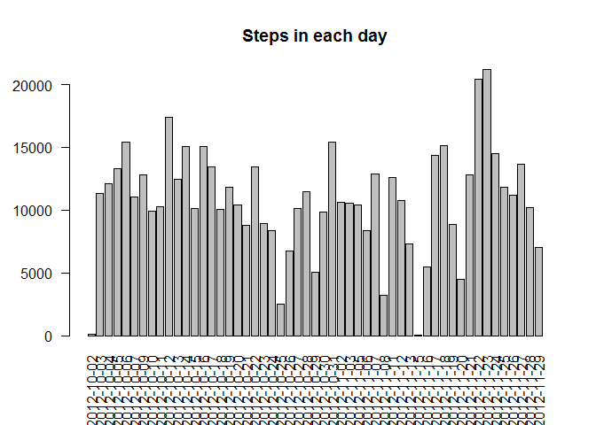
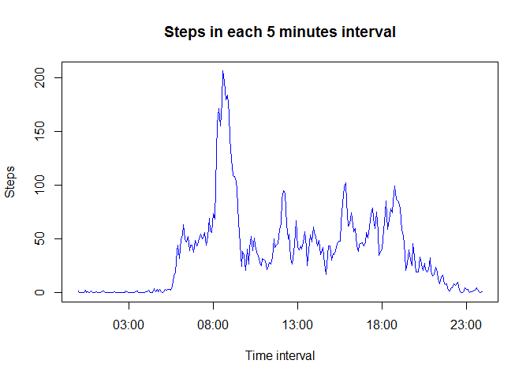
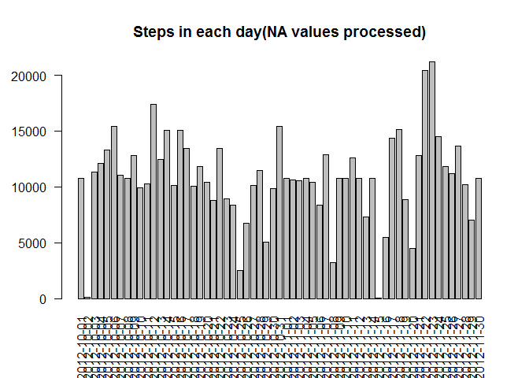

# Reproducible Research: Peer Assessment 1


## Loading and preprocessing the data

1.Load the data

```r
activity <- read.csv("activity.csv")
head(activity, 10)
```

```
##    steps       date interval
## 1     NA 2012-10-01        0
## 2     NA 2012-10-01        5
## 3     NA 2012-10-01       10
## 4     NA 2012-10-01       15
## 5     NA 2012-10-01       20
## 6     NA 2012-10-01       25
## 7     NA 2012-10-01       30
## 8     NA 2012-10-01       35
## 9     NA 2012-10-01       40
## 10    NA 2012-10-01       45
```

2.Process/transform the data into a format suitable for analysis

```r
activity$date <- as.Date(activity$date, "%Y-%m-%d")
```

## What is mean total number of steps taken per day?

1.Calculate the total number of steps taken per day

```r
daysteps <- aggregate(steps ~ date, data = activity, sum, na.action = na.omit)
```

2.Make a histogram of the total number of steps taken each day

```r
par(las = 2)
barplot(height = daysteps$steps, names.arg = daysteps$date, main = "Steps in each day")
```

 

3.Calculate and report the mean and median of the total number of steps taken per day

```r
meanDaysteps <- mean(daysteps$steps)
meanDaysteps
```

```
## [1] 10766.19
```

```r
medianDaysteps <- median(daysteps$steps)
medianDaysteps
```

```
## [1] 10765
```

The mean of the total number of steps per day is 1.0766189\times 10^{4}.
The median of the total number fo steps per day is 10765.

## What is the average daily activity pattern?
1.Make a time series plot of the 5-minute interval (x-axis) and the average number of steps taken, averaged across all days (y-axis)

```r
intervalSteps <- aggregate(steps ~ interval, data = activity, mean, na.action = na.omit)
plot(x = strptime(sprintf("%04d", intervalSteps$interval), format = "%H%M"), y = intervalSteps$steps, type = "l", col = "blue", xlab = "Time interval", ylab = "Steps", main = "Steps in each 5 minutes interval")
```

 

2.Which 5-minute interval, on average across all the days in the dataset, contains the maximum number of steps?

```r
or <- order(intervalSteps$steps, decreasing = TRUE)
maxInterval <- intervalSteps$interval[or[1]]
maxInterval
```

```
## [1] 835
```
Which means the 5 minutes between 8:30 to 8:35 contains the maximum number of steps.

## Imputing missing values
Note that there are a number of days/intervals where there are missing values (coded as NA). The presence of missing days may introduce bias into some calculations or summaries of the data.  
1.Calculate and report the total number of missing values in the dataset (i.e. the total number of rows with NAs)

```r
missingValueRows <- sum(is.na(activity$steps))
missingValueRows
```

```
## [1] 2304
```

2.Create a new dataset that is equal to the original dataset but with the missing data filled in with the mean of the same 5 minutes interval across valid days.

```r
for(i in 1:nrow(activity)){
    if(is.na(activity$steps[i])){
        for(j in 1:nrow(intervalSteps)){
            if(activity$interval[i] == intervalSteps$interval[j])
                activity$steps[i] <- intervalSteps$steps[j]
        }
    }
}
```

3.Make a histogram of the total number of steps taken each day and Calculate and report the mean and median total number of steps taken per day. Do these values differ from the estimates from the first part of the assignment? What is the impact of imputing missing data on the estimates of the total daily number of steps?

```r
daysteps2 <- aggregate(steps ~ date, data = activity, sum, na.action = na.omit)
par(las = 2)
barplot(height = daysteps2$steps, names.arg = daysteps2$date, main = "Steps in each day(NA values processed)")
```

 

```r
meanDaysteps2 <- mean(daysteps2$steps)
meanDaysteps2
```

```
## [1] 10766.19
```

```r
medianDaysteps2 <- median(daysteps2$steps)
medianDaysteps2
```

```
## [1] 10766.19
```

After imputing missing values, the mean and median total number of steps taken per day become 1.0766189\times 10^{4} and 1.0766189\times 10^{4} seperately. They are slightly different from the first part. The mean value is not changed but the median value increments from 10765 to 1.0766189\times 10^{4}. So we know that the impact of imputing missing data on the estimates of the total daily number of steps
is not obvious. I think the degree of the impact is based on the trategy we chose to imputing the missing values.

## Are there differences in activity patterns between weekdays and weekends?
For this part the weekdays() function may be of some help here. Use the dataset with the filled-in missing values for this part.  
1.Create a new factor variable in the dataset with two levels – “weekday” and “weekend” indicating whether a given date is a weekday or weekend day

```r
weekend <- c("星期六", "星期日")
for(i in 1:nrow(activity)){
    if(weekdays(activity$date[i]) %in% weekend)
        activity$week[i] <- "weekend"
    else
        activity$week[i] <- "weekday"
}
activity <- transform(activity, week = factor(week))
```

2.Make a panel plot containing a time series plot (i.e. type = "l") of the 5-minute interval (x-axis) and the average number of steps taken, averaged across all weekday days or weekend days (y-axis).

```r
intervalSteps <- aggregate(steps ~ interval + week, data = activity, mean, na.action = na.omit)
library(lattice)
xyplot(steps ~ interval | week, type = "l", data = intervalSteps, layout = c(1, 2))
```

 
